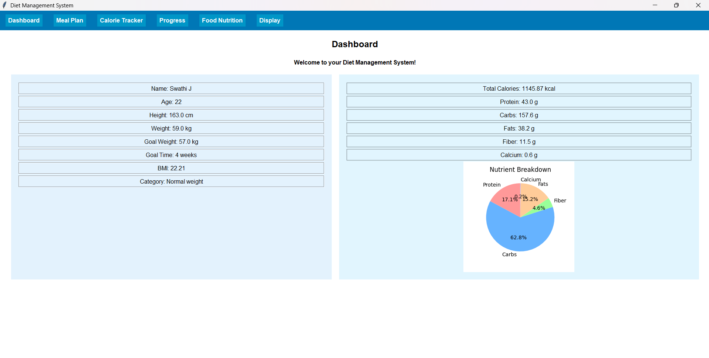
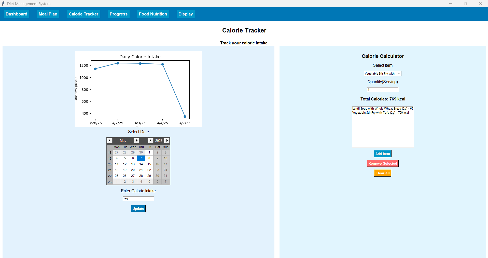

# 🥗 Diet Management System

A modern **Python Tkinter-based Diet Management System** designed to help users maintain a healthy lifestyle through personalized calorie tracking, meal planning, nutrition analysis, and progress monitoring.

---

# 📌 Project Overview

This application helps users:

- Track daily calorie intake
- Monitor weight progress
- View personalized meal plans
- Analyze nutrition information
- Calculate recommended calorie intake
- Manage users through an admin panel

Built using:

- Python
- Tkinter
- SQLite
- Matplotlib
- Pillow (PIL)

---

# ✨ Features

## 👤 User Module

- User Registration & Login
- Strong Password Validation
- Personalized Dashboard
- BMI Calculation
- Daily Calorie Tracking
- Weight Progress Monitoring
- Food Nutrition Guide
- Meal Plan Viewer

---

## 🍽️ Meal Planning

- Weekly Meal Plans
- Breakfast, Lunch, Dinner & Snacks
- Nutritional Breakdown
- Ingredient Information

---

## 📊 Analytics & Visualization

- Daily Calorie Graphs
- Weight Progress Charts
- Nutrient Distribution Pie Charts

---

## 🛠️ Admin Panel

- Add / Update / Delete Users
- View User Details
- Manage User Records

---

# 🧠 Technologies Used

| Technology | Purpose |
|---|---|
| Python | Core Programming |
| Tkinter | GUI Development |
| SQLite | Database |
| Matplotlib | Data Visualization |
| Pillow (PIL) | Image Handling |
| tkcalendar | Calendar Widget |

---

# 📂 Project Structure

```bash
Diet-Management-System/
│
├── home.py
├── admin.py
├── userProfile.py
├── mealplan.py
├── signUp.py
├── DietDB.py
├── FoodDB.py
├── progress.py
├── diet_management.db
│
├── img4.png
├── bg1.png
└── README.md
```
# Dashboard



# Login Page


---

# ⚙️ Installation

## 1️⃣ Clone Repository

```bash
git clone https://github.com/your-username/diet-management-system.git
cd diet-management-system
```

---

## 2️⃣ Install Required Libraries

```bash
pip install pillow matplotlib tkcalendar
```

---

## 3️⃣ Run the Application

```bash
python home.py
```

---

# 🗄️ Database Tables

The system uses SQLite with the following tables:

- Users
- Food
- Meal
- daily_calorie_intake
- progress

---

# 🔐 Authentication Features

- Login System
- Admin Access
- Password Strength Validation
- Unique User Contact Validation

---

# 📈 Key Functionalities

## ✅ Calorie Calculator

Automatically calculates:

- Daily calorie requirement
- Protein intake
- Carbohydrates
- Fiber
- Fats

---

## 📅 Meal Plan Management

Users can:

- View weekly meal plans
- Check nutritional details
- Explore ingredients

---

## 📊 Progress Tracking

- Weight progress graphs
- Weekly updates
- Calorie tracking history

---

# 🎯 Future Improvements

- AI-based diet recommendation
- Barcode food scanner
- Real-time notifications
- Cloud database integration
- Mobile app version
- Dark mode UI
- Export reports as PDF

---

# 👩‍💻 Author

**Swathi Janakiram**

MCA Graduate | Python & Full Stack Developer

---

# ⭐ Support

If you like this project:

- Give it a ⭐ on GitHub
- Fork the repository
- Contribute improvements

---
